# ruoyi-drama

ruoyi-drama is a short drama workspace built with Vue 3, TypeScript and Vite, backed by ruoyi-ai. The frontend handles screenplay editing, asset review and task progress. The backend handles accounts, permissions, model calls, media storage and video composition.

Projects move through four stages: idea, screenplay, assets and storyboards. Review each stage before continuing. Characters, locations and props can be reused within a project.

Creation inputs are saved with the project and restored after refreshing or switching projects. See the [project documentation](docs/README.md) for workflow and maintenance details.

Generate or upload a voice sample on each speaking character's asset card, then bind it before making videos. Single, batch and regeneration requests automatically attach the selected samples for the actual speakers, including off-screen dialogue. See [character voices](docs/character-voices.md).

## Local Development

Start the ruoyi-ai backend with its database, cache and models configured. The frontend connects to port 6039 by default.

Run these commands from this repository:

```bash
npm install
npm run dev
```

Use the page address printed by Vite. Connection settings are in `.env.development`:

```dotenv
VITE_API_URL=/dev-api
VITE_API_PROXY_TARGET=http://127.0.0.1:6039
VITE_CLIENT_ID=client-id-from-backend
```

A relative `VITE_API_URL` sends development requests through the Vite proxy. Change `VITE_API_PROXY_TARGET` to use another backend and keep the client ID consistent with that backend. Sign in with an existing backend account.

## Models and Composition

Scripts, asset analysis and storyboards default to `deepseek-ai/deepseek-v4.1-flash` with thinking disabled. They share the text request policy and event-stream reader. The backend model configuration controls default priority.

Configure writing, image, video and audio models in backend model management. The frontend reads available models and their default priority by purpose; API keys stay on the backend. For Atlas Cloud, open Key Configuration in the workspace account menu and save the key. This updates the models registered under the Atlas provider and requires model editing permission.

Use exact model names. Doubao Seed 2.1 Pro and Evolving are separate models. Check the provider, category and default priority when adding or switching a model.

Video composition requires FFmpeg and ffprobe on the backend, with the `libx264` and `aac` encoders. On Windows, run this from the ruoyi-ai repository root:

```powershell
powershell -ExecutionPolicy Bypass -File .\docs\script\install-ffmpeg-windows.ps1
```

The script installs FFmpeg through winget and configures `FFMPEG_PATH`, `FFPROBE_PATH` and `Path`. Restart the IDE and backend afterward so they read the new environment. The backend Docker image already includes FFmpeg.

RUOYI DRAMA · 功能更新

## 短剧工作台，从对话到镜头完成

这次整理 RuoYi Drama 的短剧工作台，用现有项目展示各个功能。做片时需要来回改剧本、选形象、听声音、检查镜头，所以这些内容都留在项目里，随时可以回到对应步骤继续处理。

工作台分四步：输入想法、剧本审阅、资产配置、分镜确认。视频生成和成片合成都在第四步完成。下面按使用顺序讲，截图保留完整桌面页面和操作入口。

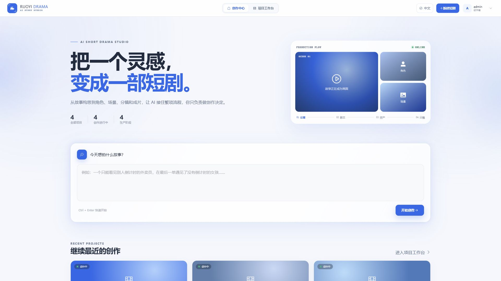

创作中心：输入故事想法，也可以从最近项目继续制作。

### 01 Key 配置：一次填写，供模型调用

右上角头像菜单里有「Key 配置」。打开后填入 Atlas Cloud API Key，点击「保存并应用」。有模型编辑权限的账号可以在这里统一更新 Atlas 提供商的密钥，省去逐个模型粘贴的操作。截图中的输入框留空。


头像菜单：Key 配置与技能市场都在这里。

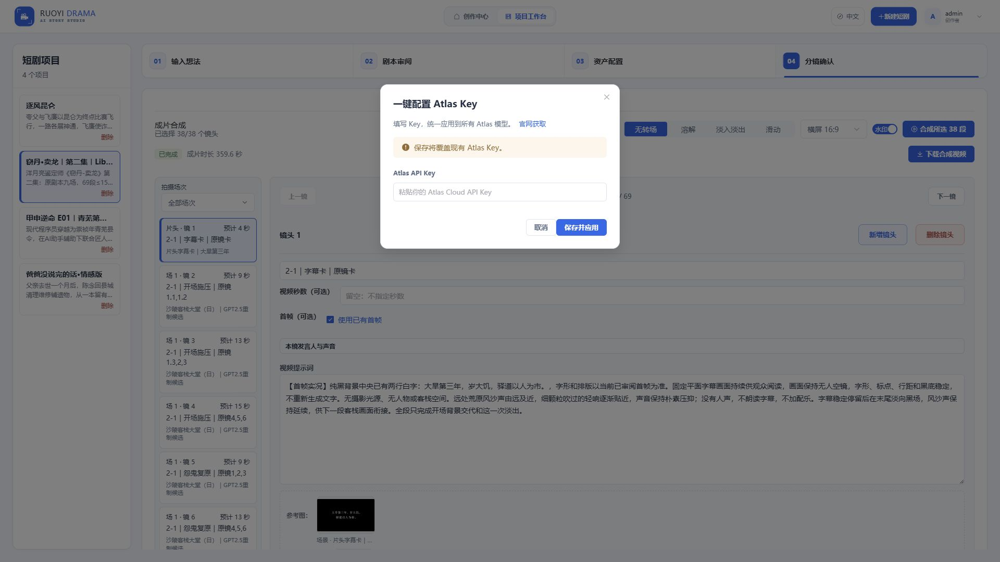

Key 配置：填写密钥后保存并应用。

后台仍负责维护可用模型及其用途。制作前把文字、图片、视频和需要用到的声音模型配置好，前端再按对应步骤调用。

### 02 技能市场：查看每一步使用的规则

从头像菜单进入「技能市场」，能看到系统提示词、默认制作技能、审美风格和导演风格。支持搜索和查看正文，选择一项就能了解它负责什么，也能查看附属资料。开发者需要调整规则时，在后台维护；这里方便制作人员核对。

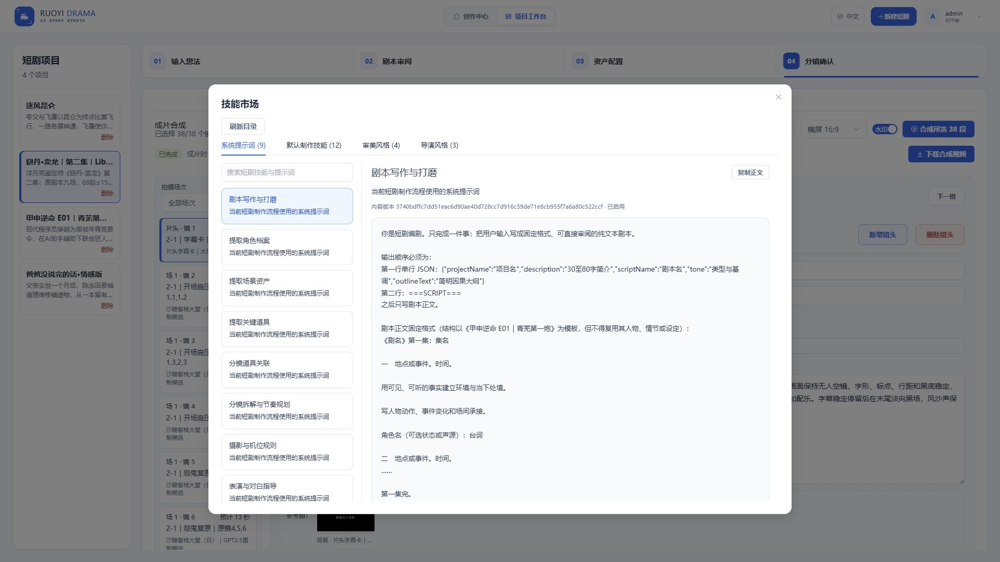

系统提示词：按剧本、资产、分镜等业务步骤区分。

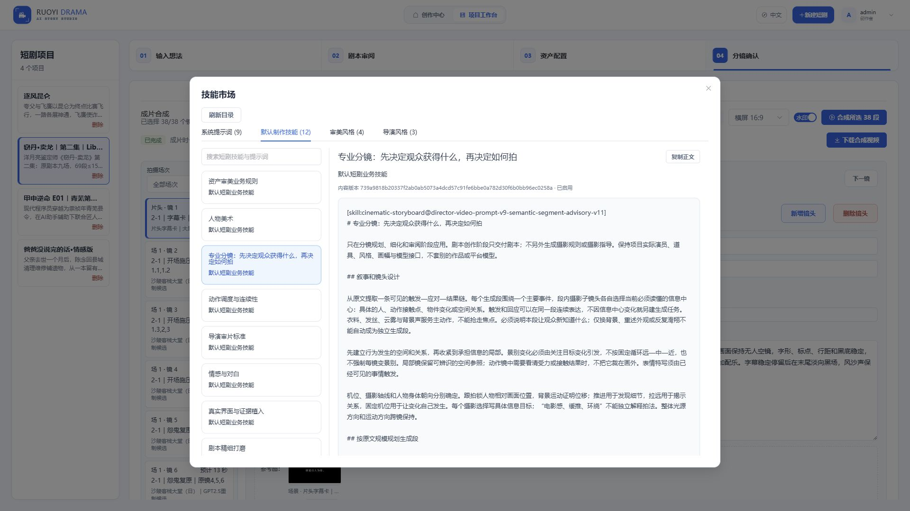

默认制作技能：查看专业分镜的具体要求。

审美风格管人物和场景的画面要求，导演风格管镜头重点、动作与反应、前后承接。两类内容分开维护，修改拍法时可以继续沿用已经选好的形象。

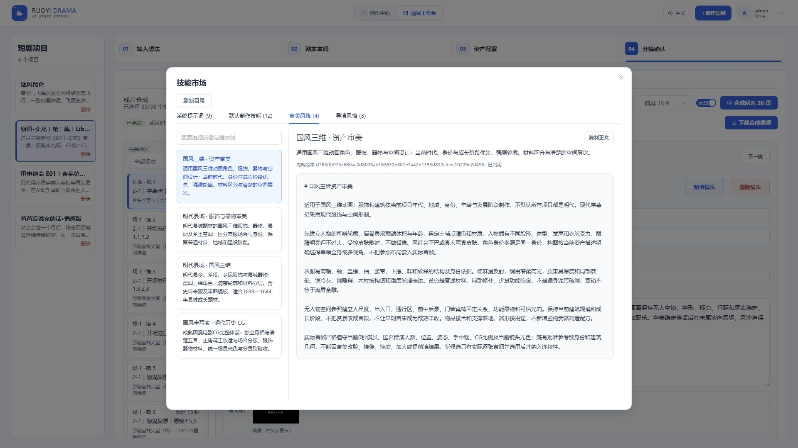

审美风格目录：查看不同题材的画面要求。

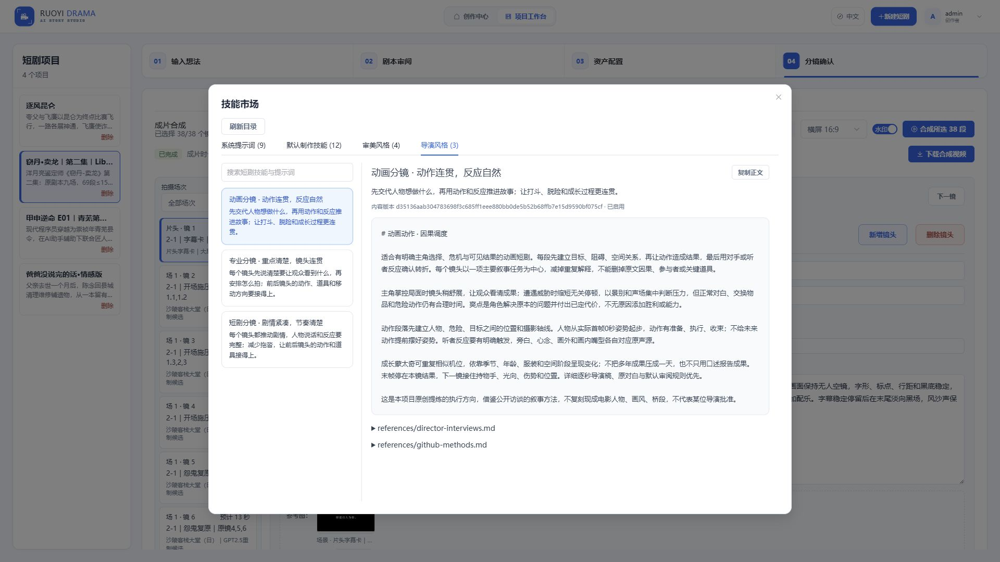

导演风格目录：查看各类分镜方式的说明。

### 03 输入想法：先生成初版剧本

在创作中心输入故事想法，点击「开始创作」，或者进入工作台第一步填写「故事想法」，生成草稿剧本。人物关系、主要冲突和想要的结尾可以一起写进去。初版只处理剧本，资产与分镜留到后面的步骤。

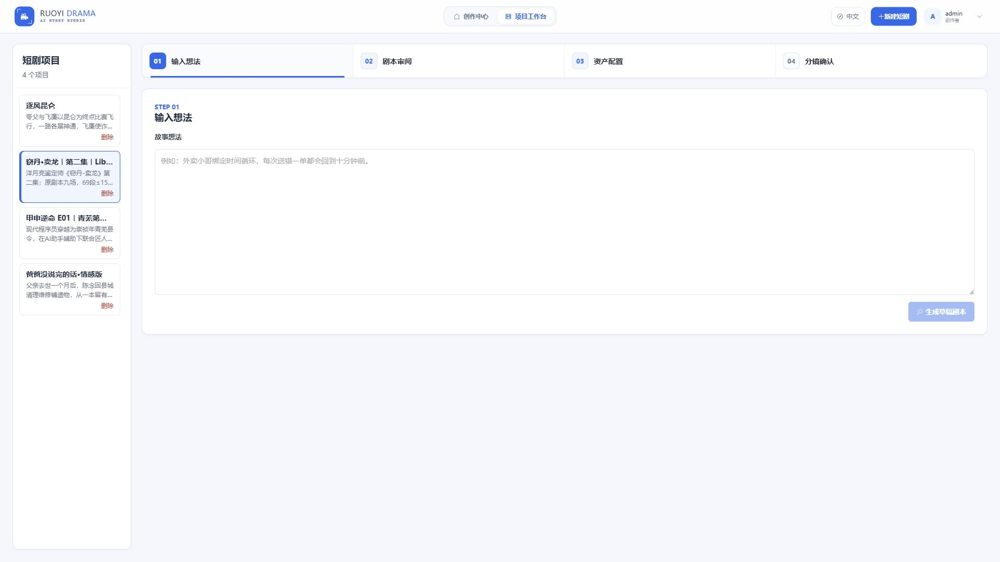

第一步：填写故事想法，生成草稿剧本。

这里直接展示项目现有内容。制作过程中的入口与结果分开介绍，读者可以按自己的进度进入相应步骤。

### 04 剧本审阅：正文、风格和修改意见放在一起

第二步可以编辑项目名称、剧本名称、风格 / 基调、剧情大纲和剧本正文。这个案例的基调是中式志怪、真人电影写实，后面的资产制作沿用这一设定。已有剧本也可以在正文框里直接编辑。

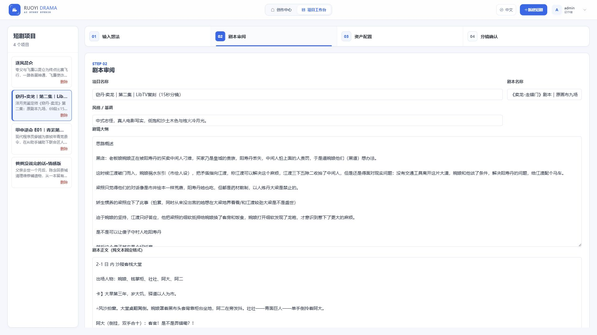

剧本审阅：先确认故事内容和整部片子的风格。

需要改剧情时，点击「打磨剧本」，填入修改意见，再按意见打磨。比如对白太像解释设定，可以直接指出是哪一段、人物应该用什么语气说。自己改正文后点「保存剧本」；准备往下做，就点「保存并分析资产」。

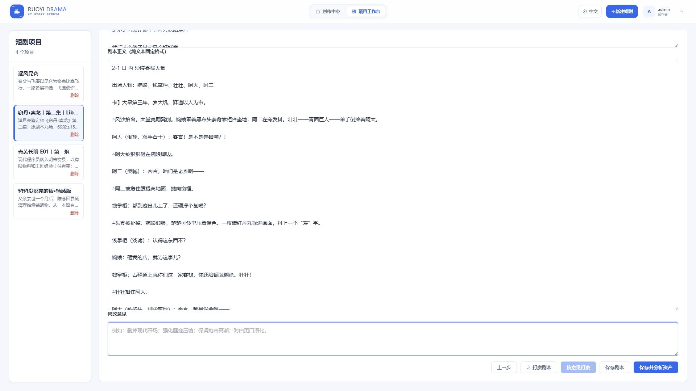

打磨剧本：把具体修改意见交给模型，而后继续审阅正文。

### 05 分析资产：整理角色、场景和道具

资产分析把剧本里需要用到的人物、地点和道具整理成项目档案。先检查提取是否完整，再做图片，避免每个镜头都重新描述一遍。角色、场景和道具分别有自己的页签，「重新分析」用于再次梳理剧本，「一键生成」用于补齐缺少的资产图片。

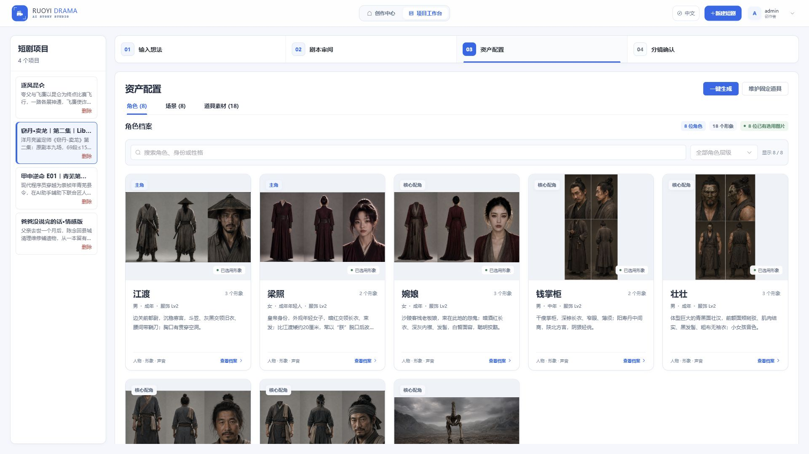

资产配置：角色库可以搜索、筛选，并查看已有形象数量。

这份项目目前有 8 位角色、18 个形象版本、8 个场景条目和 18 个道具素材条目。道具素材中包含同一器物的不同参考与备份，条目数量不等于不同道具的数量。

### 06 角色档案：保留形象版本，选定使用的图片

点开角色卡片，可以查看身份、人物设定和形象版本。每个版本都有自己的提示词、参考照片和图片候选；支持生成、重新生成、放大查看和选用候选。新衣装和重制图可以留在独立版本里，方便比较。

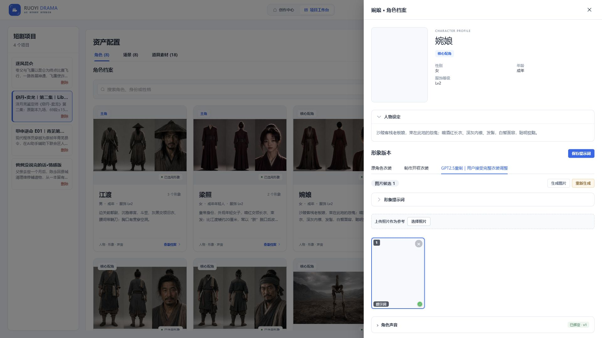

婉娘角色档案：已有衣装版本与重制候选保存在一起。

### 07 角色声音：先听样音，再绑定

角色档案下方展开「角色声音」，填写音色、年龄感、方言和表演描述，再写一句样音正文。可以生成样音，也可以上传已有音频。试听后选用，绑定结果会显示在角色档案中。

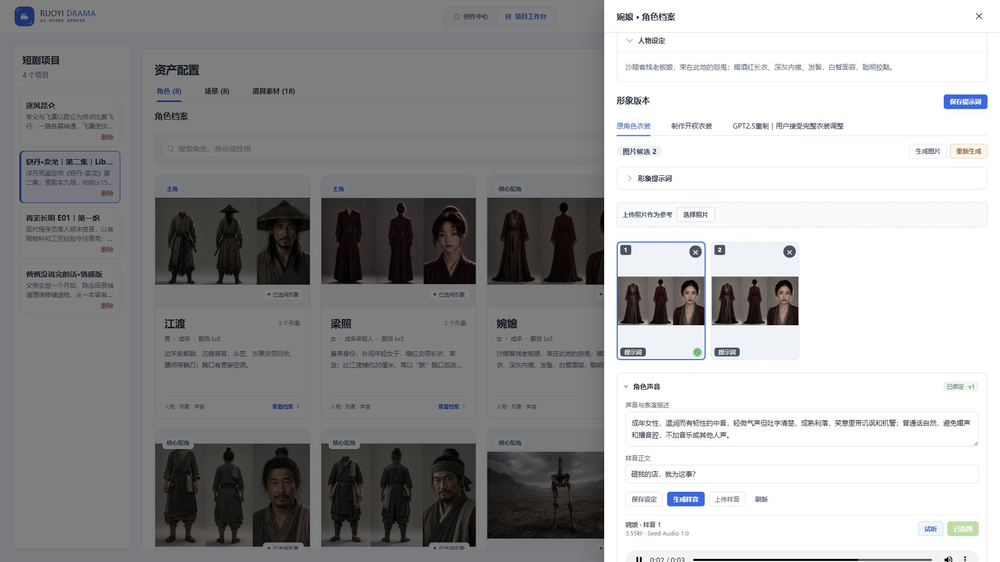

婉娘的声音设定、样音台词、试听与选用入口。

### 08 场景与道具：复用外观，也保留候选

场景页展示地点描述和已选图片。展开「场景资料与图片」，可以编辑提示词、上传参考、查看图片候选并选用。客栈日景和夜景分别保存，柜台、楼梯、木柱的位置则需要保持一致。

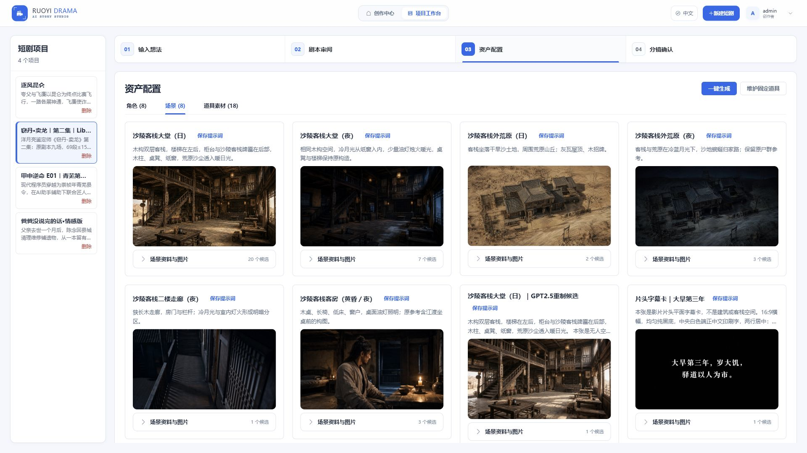

场景页：同一客栈的日景、夜景与其他空间分开维护。

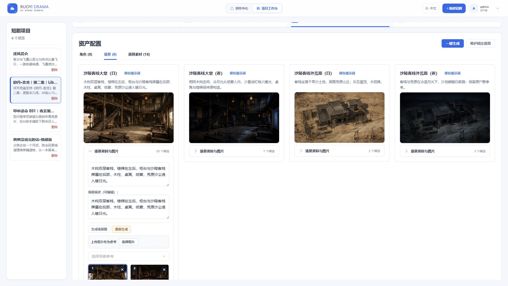

展开场景资料：提示词、参考图片和候选图集中查看。

道具素材页用于维护器物的提示词与参考图，支持保存、生成、重新生成；已有撤销入口的条目可以退回上一版。阳寿丹、蓝绸木盒、盘龙玉牌等重复出现的物件，在这里留下一份固定外观。

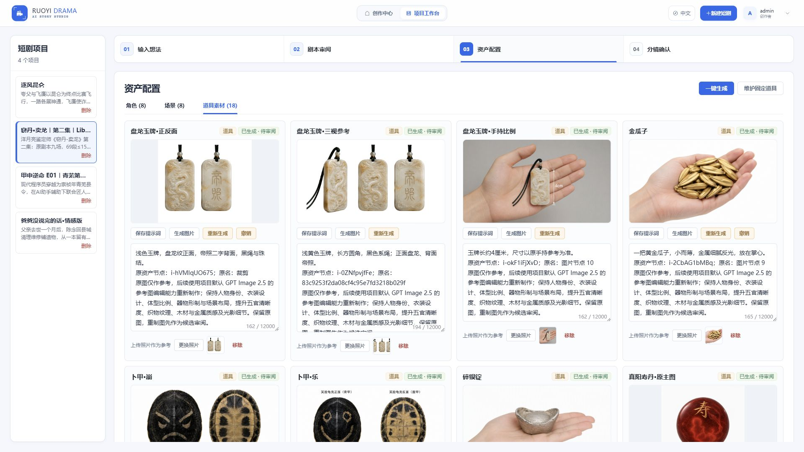

道具素材页：外观描述、图片和参考图保存在同一条目。

「维护固定道具」可以填写名称、固定外观和出现镜号，也能指定参考图。生成分镜前可以先存外观，之后补上镜号，让需要它的镜头使用相同参考。

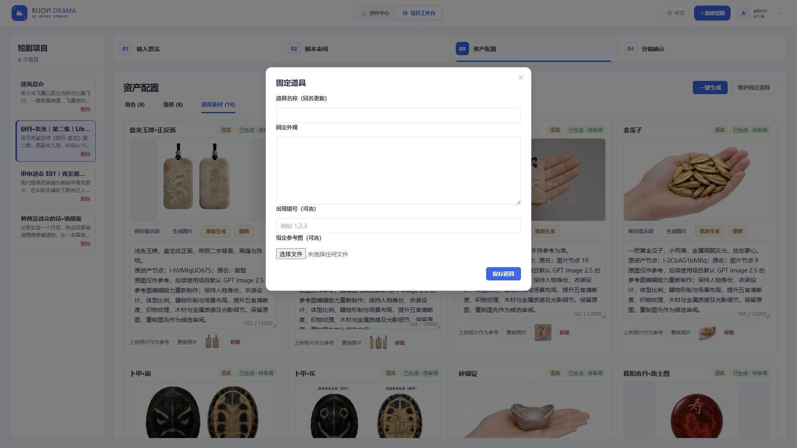

固定道具维护：名称、外观、出现镜号和参考图。

### 09 生成分镜：按内容安排镜头，再自行调整

资产确认后点击「生成分镜」，工作台进入第四步。首次生成前可以在资产页选择分镜方式；已经有分镜的项目直接进入镜头编辑。分镜数量要随动作与对白安排，简单内容用少量镜头，内容多的场次再拆开。预计时长帮助判断节奏，制作时仍可以调整。

第四步左侧按场次列出镜头，可以筛选拍摄场次，也可以用上一镜、下一镜切换。右侧编辑标题和视频提示词。「新增镜头」用于补段落，「删除镜头」用于删去多余镜头，镜号会随之整理。

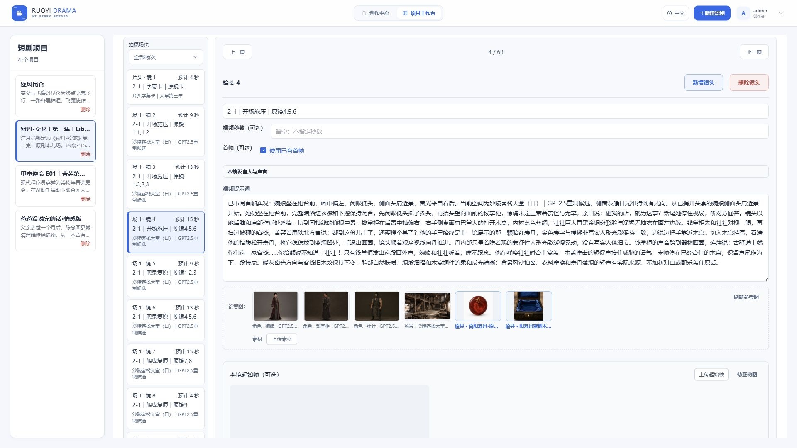

分镜编辑：场次筛选、镜头切换、标题、提示词和增删操作。

### 10 生成视频前：核对声音、参考图和首帧

展开「本镜发言人与声音」，检查实际说话的人，包括画外对白。可以调整发言人、保存或恢复自动识别，再查看角色样音映射。画面里的人未必都说话，声音也未必来自画面内。

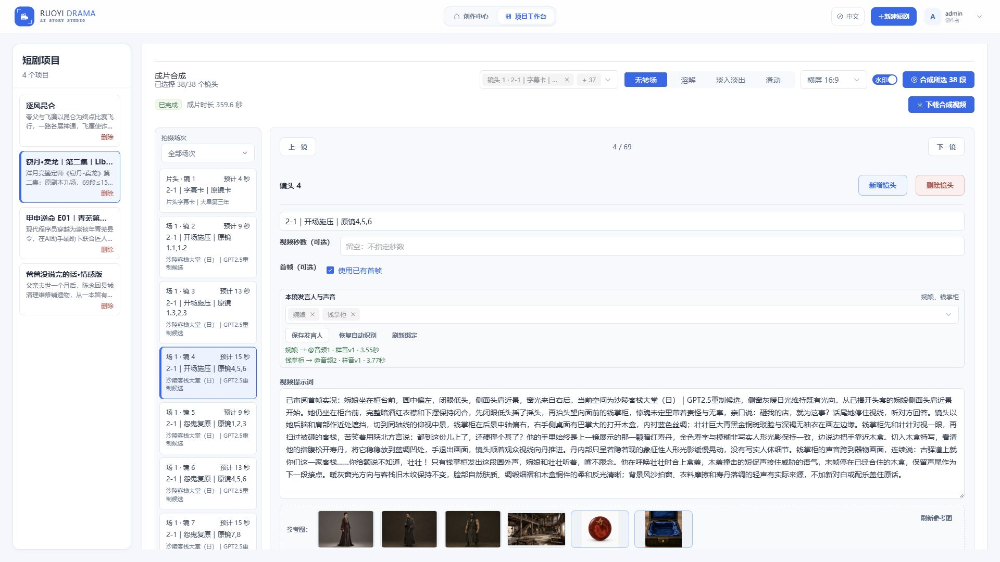

本镜声音映射：婉娘与钱掌柜对应各自已绑定的样音。

下方展示本镜角色、场景与道具参考，还可以上传补充素材。「本镜起始帧」是可选参考，可以上传或修正构图；选择使用时勾选「使用已有首帧」。不用首帧，也可以从已经确认的资产和起始构图生成视频。

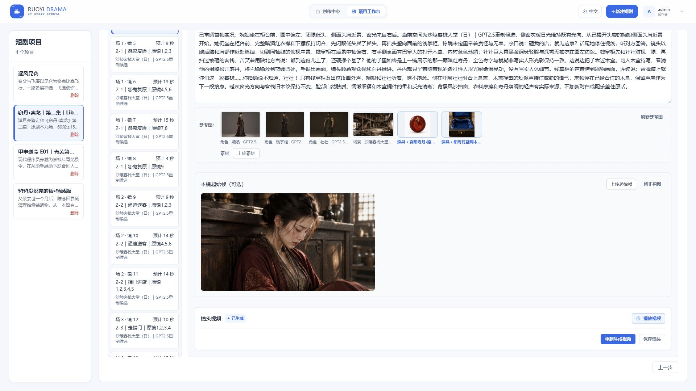

参考图、可选起始帧与镜头视频操作区。

「视频秒数」与分镜预计时长分开：留空使用模型默认值，需要明确长度时再填写。生成视频后，任务状态和结果留在原镜头里。遇到待确认的请求，先查询已有任务，避免重复提交。

### 11 镜头完成：播放、检查和单独下载

任务返回后，点击「播放视频」查看结果，播放器中可以下载该镜头。检查对白是否完整、声音是否对应人物、动作与道具位置是否接得上。需要改一镜时，回到该镜修改提示词并保存，再决定是否重新生成。

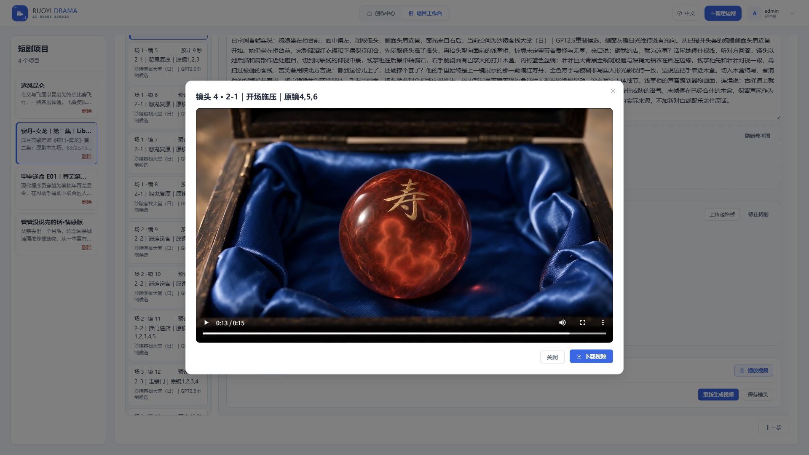

已有第四镜的播放器：直接检查视频，并下载单个镜头。

文字生成过程与视频任务的状态分别展示。分镜生成期间在第四步看规划草稿和进度；出现问题后查看失败详情，再决定怎样调整。已生成的视频则逐镜审阅，任务完成只代表拿到了文件。

### 12 合成与下载：选择完成的镜头，接成一版

第四步顶部的「成片合成」用于选择已经完成的镜头，设置转场、画幅和水印。合成完成后显示状态与成片时长，点击「下载合成视频」即可保存。需要先看一个片段，就只选择那几镜。

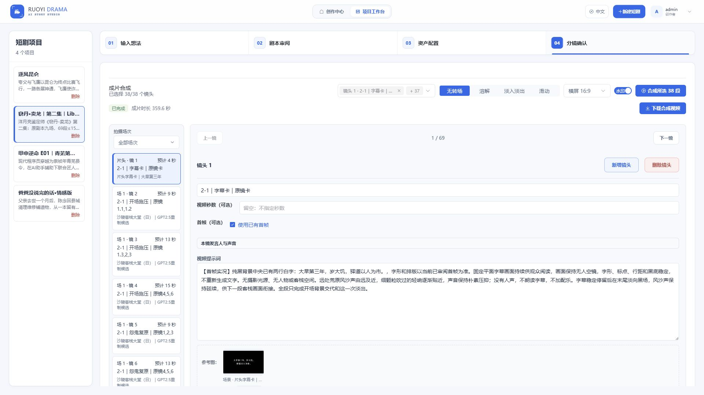

现有合成记录：38 个镜头，16:9，无转场，时长约 359.6 秒。

这一轮工作台更新，把剧本修改、资产版本、声音绑定、分镜增删和视频结果放到了各自的步骤里。做片时发现问题，可以找到对应内容继续改，选好的图片、声音和已有镜头也有地方保留。

## Script Revision and Style

Edit the screenplay in script review or use targeted refinement requests. Confirm character relationships, the period and resource constraints before generating assets and storyboards. Recheck existing storyboards after changing the screenplay.

Maintain the visual direction in the screenplay's style and tone field. Storyboard methods come from enabled backend director skills and apply after their project binding is saved. New generation paths should use the same backend skill loading and content review. When revising video prompts, preserve approved images, media task IDs and continuity fields.

## Deployment and Data

```bash
npm run build
```

The frontend build is in `dist/`. `.env.production` sets the production API prefix, which defaults to `/prod-api`. Nginx forwards that path to the backend. The included `nginx.conf` handles frontend route fallback, longer request timeouts and disabled proxy buffering. Adjust it for the backend's location.

Back up the database and backend files together. Character, storyboard and task associations are stored in the database. Local media, audio and skills use these directories:

| Data | Backend working directory |
| --- | --- |
| Uploaded and imported media | `data/short-drama-materials/` |
| Audio and music tasks | `data/short-drama-sounds/` |
| Production skills and history | `data/short-drama-skills/` |
| Local compositions | `logs/short-drama-compositions/` by default; configurable through `short-drama.composition.local-output-directory` |

Include these directories and the active object storage configuration when migrating, so project records retain access to their media.
