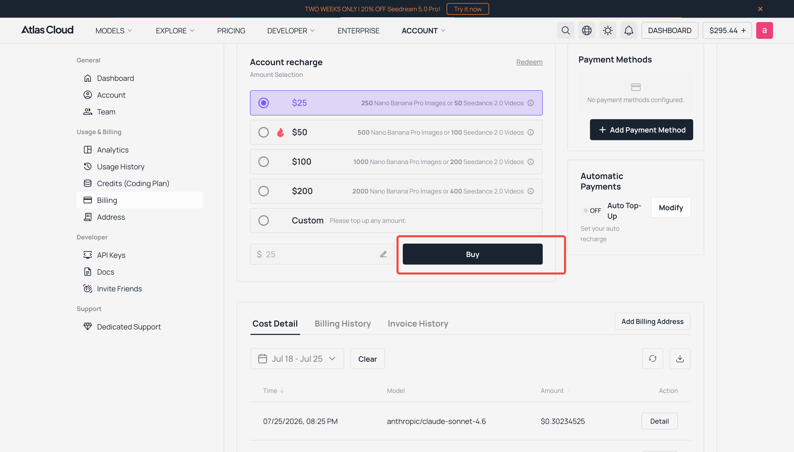
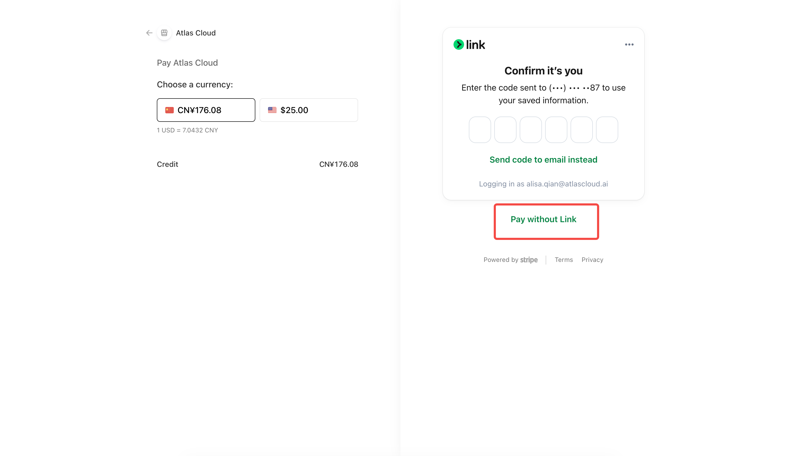
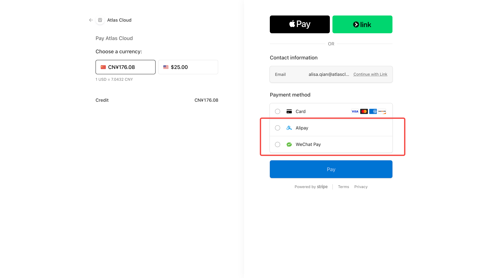

# ruoyi-drama

**[中文](README_ZH.md)**

> **Backend service** (the short drama frontend depends on this backend):
>
> | Platform | URL |
> | ------- | ------------------------------------------------- |
> | GitHub | https://github.com/ageerle/ruoyi-ai |
> | Gitee | https://gitee.com/ageerle/ruoyi-ai |
>
> Start the backend by following the [ruoyi-ai](https://github.com/ageerle/ruoyi-ai) documentation. The default address is `http://127.0.0.1:6039`, and this frontend connects to it through the Vite proxy.

## Screenshots

The complete short drama creation workflow, from entering an idea to producing the final video: creation center → one-click Atlas Key configuration → script refinement → asset configuration → storyboard confirmation and video synthesis.


## Quick Tutorial

### 1. Start the Backend
Follow the [ruoyi-ai](https://github.com/ageerle/ruoyi-ai) documentation to start the backend service and make sure `http://127.0.0.1:6039` is reachable.

### 2. Start the Frontend
```bash
npm install
npm run dev
```
Vite prints the default development address. The default backend address is `http://127.0.0.1:6039`.

To use a different backend, update `.env.development`:

```dotenv
VITE_API_URL=/dev-api
VITE_API_PROXY_TARGET=http://your-backend-host:port
VITE_CLIENT_ID=client-id-from-backend
```

When `VITE_API_URL` uses a relative path, requests go through the Vite proxy to avoid browser CORS issues. You can also set it to the full backend URL, but the backend must allow cross-origin requests.

### 3. Sign In and Create
Open the frontend and sign in with a backend account (the default administrator account is `admin` / `admin123`). On the Creation Center home page, enter a story idea and click **Start Creating** to open the short drama workspace, then complete script refinement, asset configuration, storyboard confirmation, and video synthesis.

### 4. Configure the Atlas Key with One Click (Important)
Image and video generation depends on [Atlas Cloud](https://www.atlascloud.ai/zh?ref=89F97E&utm_source=github&utm_campaign=ruoyi-drama). Configure an API Key before using these features:

1. Click **Key Configuration** in the upper-right corner of the Creation Center home page.
2. Paste your Atlas Cloud API Key in the dialog. You can obtain one from [atlascloud.ai](https://www.atlascloud.ai/zh?ref=89F97E&utm_source=github&utm_campaign=ruoyi-drama).
3. Click **Save and Apply**. The system applies the key to all Atlas models in bulk; the same key is used for chat, image, and video generation.
4. When **Atlas Key updated successfully** appears, return to the short drama workspace to generate images and videos.

> This calls the backend endpoint `PUT /system/model/batchKeyByProvider`, which updates `chat_model.api_key` for the provider code `atlas`. The account must have the `system:model:edit` permission.

### 5. Purchase Atlas Cloud Credits (Alipay / WeChat Pay)
1. Open [Atlas Cloud](https://www.atlascloud.ai/zh?ref=89F97E&utm_source=github&utm_campaign=ruoyi-drama), choose a recharge amount, and click **Buy**.



2. At checkout, select CNY if prompted. If it opens the Link verification or sign-in flow directly, select **Pay without Link** to cancel the Link flow.



3. You will return to the payment-method screen. With CNY selected, choose **Alipay** or **WeChat Pay**, then click **Pay** to complete the purchase.



### 6. Install FFmpeg (Required for Video Synthesis)
The short drama video synthesis feature depends on backend FFmpeg with the `libx264` and `aac` encoders. On Windows, use the script provided by the `ruoyi-ai` repository to install FFmpeg and configure the environment variables:

```powershell
# Run from the ruoyi-ai repository root in Windows PowerShell
powershell -ExecutionPolicy Bypass -File .\docs\script\install-ffmpeg-windows.ps1
```

The script:
1. Checks whether `ffmpeg` and `ffprobe` are installed and uses `winget` to install `Gyan.FFmpeg` when they are missing;
2. Writes the absolute paths to the user environment variables `FFMPEG_PATH` and `FFPROBE_PATH`, and appends them to `Path`;
3. Verifies that the `libx264` and `aac` encoders are available and fails if they are missing.

> After installation, **fully restart IntelliJ IDEA and the ruoyi-ai backend service** so that Spring reads the new `FFMPEG_PATH` and `FFPROBE_PATH` values.
> The script requires `winget`. If it is not installed, install **App Installer** from the Microsoft Store first. You can also run the backend with the project Dockerfile, which already includes FFmpeg.

## Production Build

```bash
npm run build
```

The build output is generated in `dist/`. The default production API prefix is `/prod-api`; the example `nginx.conf` proxies this prefix to `http://127.0.0.1:6039`. Adjust `proxy_pass` for your deployment environment.

---

## Exclusive Sponsorship

Visit [Atlas Cloud](https://www.atlascloud.ai/zh?ref=89F97E&utm_source=github&utm_campaign=ruoyi-drama) for the developer plan.

A multimodal AI inference platform that provides a unified AI API for video generation, image generation, and large language models. One integration gives you access to 300+ selected models.
