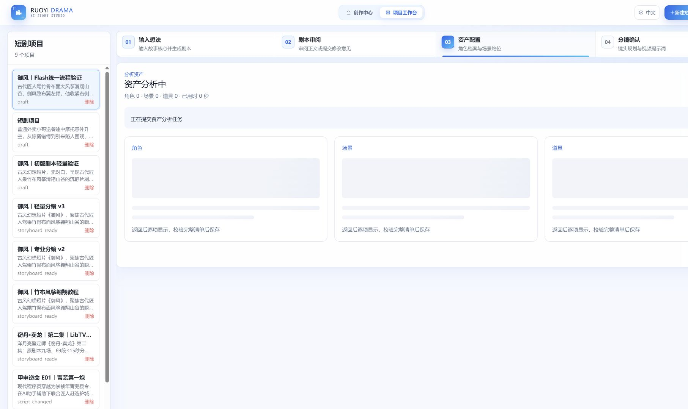
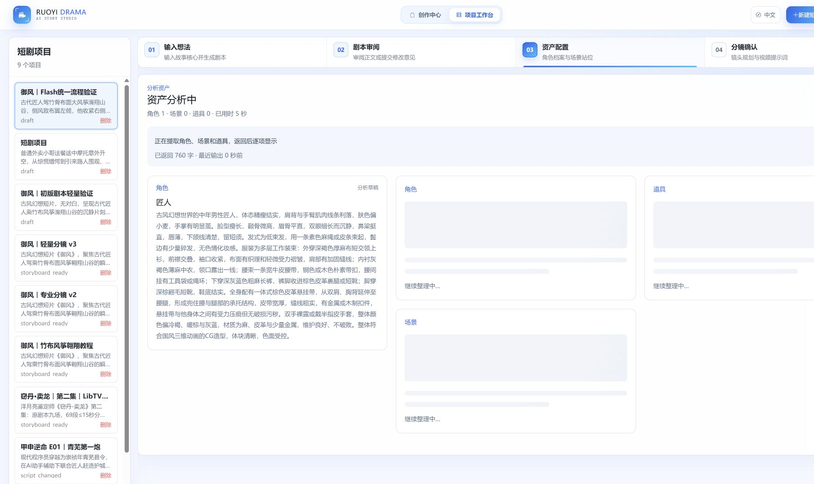
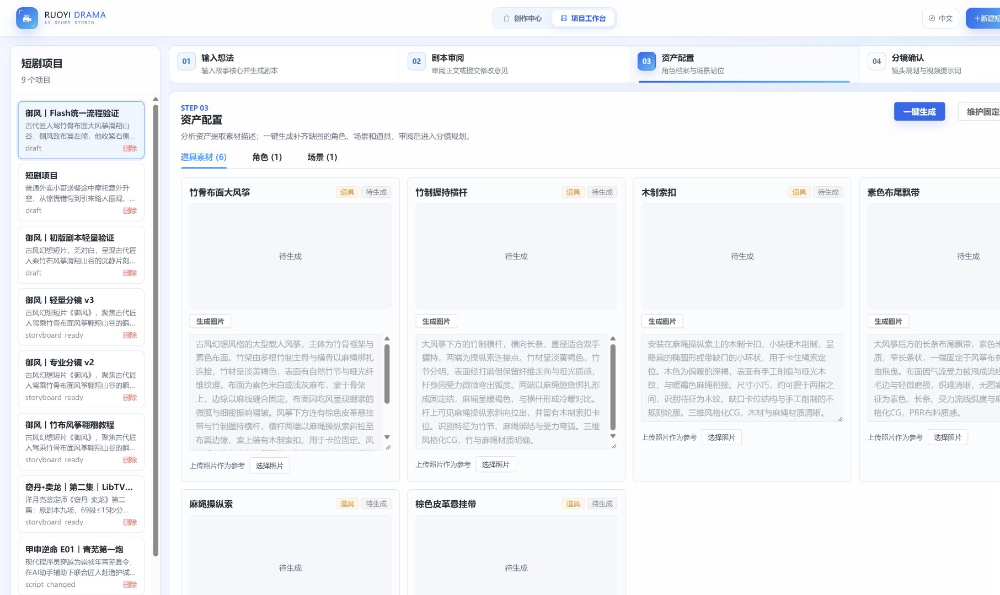

# 资产分析与文字生成

剧本、资产和分镜共用 `ShortDramaWritingRequest` 的模型参数，以及前端 `readDramaEventStream` 的事件读取。资产和分镜还共用 `useTextGeneration` 的请求身份、进度查询和恢复流程。默认模型是 Atlas 的 `deepseek-ai/deepseek-v4.1-flash`；同步与流式 DeepSeek 请求均发送 `thinking.type=disabled`。

点击「保存并分析资产」后立即进入第3步。页面先显示角色、场景、道具占位，展示已用时间、已返回字数、最近输出时间。完整资产条目返回时显示草稿卡片，整批检查通过后才保存。

一次模型请求返回角色档案及形象描述、场景及空场景描述、道具及独立出图描述。不会再逐角色调用模型，也不会追加一次道具分析。角色、场景和道具都验证完后，在同一事务中保存。保存前锁定并核对剧本原文、世界观和基调，检查项目技能版本；期间修改剧本或技能会阻止旧结果写入。

重新分析按名称补充缺少的资产，保留既有角色、形象、场景和道具的ID、描述、已批准图片及媒体任务。不删除本轮未列出的旧资产。资产分析只生成文字，不提交图片或视频。

## 请求与恢复

- POST `/short-drama/{projectId}/analyze-assets/stream?scriptId=…&requestId=…&model=…`：客户端生成一次UUID，返回登记回执、进度及完成事件。
- GET `/short-drama/{projectId}/analyze-assets/status?scriptId=…&requestId=…`：只读查询原请求，返回 `queued/running/done/error`、调用计时和草稿卡片。
- 原同步 `/analyze-assets` 入口保留，调用同一个单次生成与保存方法。
- 同一UUID、剧本和模型重复请求只返回回执，不再次调用模型；UUID不能用于另一份正文或模型。
- 回执与进度保存7天。资产和分镜使用独立缓存命名空间，复用状态机与心跳实现。
- 刷新工作台、切换项目、连接中断时查询原任务，不自动重提。错误或草稿不代表已保存。
- 初版剧本在同一浏览器会话内保留任务，整页刷新后的服务器任务恢复尚未提供；资产和分镜具备持久化回执。

