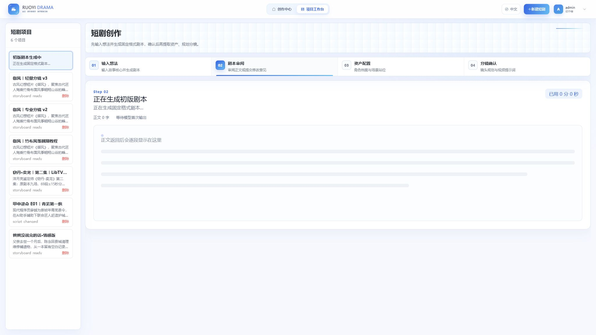
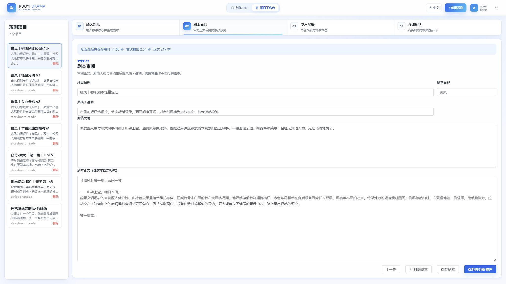

# 初版剧本生成与进度

点击「生成草稿剧本」后立即进入第2步。正文返回后逐段展示，同时显示已用时间、正文字符数、首次输出时间和最近输出时间。30秒未收到新内容时，页面明确显示仍在等待原请求，不以持续转圈表示模型正在输出。

生成期间可以切换到其他项目，侧栏保留「初版剧本生成中」入口。原请求继续读取，返回入口可以查看已输出的正文；按钮防止同一页面重复提交。完成后刷新项目列表，只有仍在当前草稿审阅页时才打开新剧本，查看其他项目时保留当前页面。

初版生成始终使用一次模型调用，仅保存项目信息和固定格式剧本。此步不分析角色、场景、道具，不规划分镜，也不生成摄影规则、摄影指导、图片或视频。剧情大纲与风格/基调属于剧本信息，后续制作由各步骤按钮触发。

剧本、资产分析和分镜使用同一个 `ShortDramaWritingRequest` 参数策略及前端事件流读取器。默认 Atlas 模型为 `deepseek-ai/deepseek-v4.1-flash`，同步和流式调用均明确发送 `thinking.type=disabled`，不再触发 DeepSeek 的高强度思考。Seed 2.1 Pro 作为可选模型保留短输入 `none`、长输入 `low` 的策略。页面不显示或保存原始思考内容。

当前初版进度在同一浏览器会话的项目切换间保留；整页刷新后的初版流恢复与服务器任务查询尚未提供，页面不会自动重提。分镜任务的持久化回执与刷新恢复见[分镜生成与进度](storyboard-generation-progress.md)。

