# Mini 2.0之后，我用RuoYi Drama做了一部电影感古装短剧

之前，我们一直用低成本的 Seedance 2.0 Mini，做一些剧情简单的动画。

那如果想做更精细、往电影级别靠近的短剧，能不能做？

可以。

这次，我就用 RuoYi Drama，参考了 Rick 在 LibTV 上的热剧《长安异闻录》第一卷·算命，做了一版古装写实短剧。人物有固定形象，场景有昼夜变化，镜头里有对白、有反应，也有道具和人物之间的空间关系。

先看几张实际成片画面。

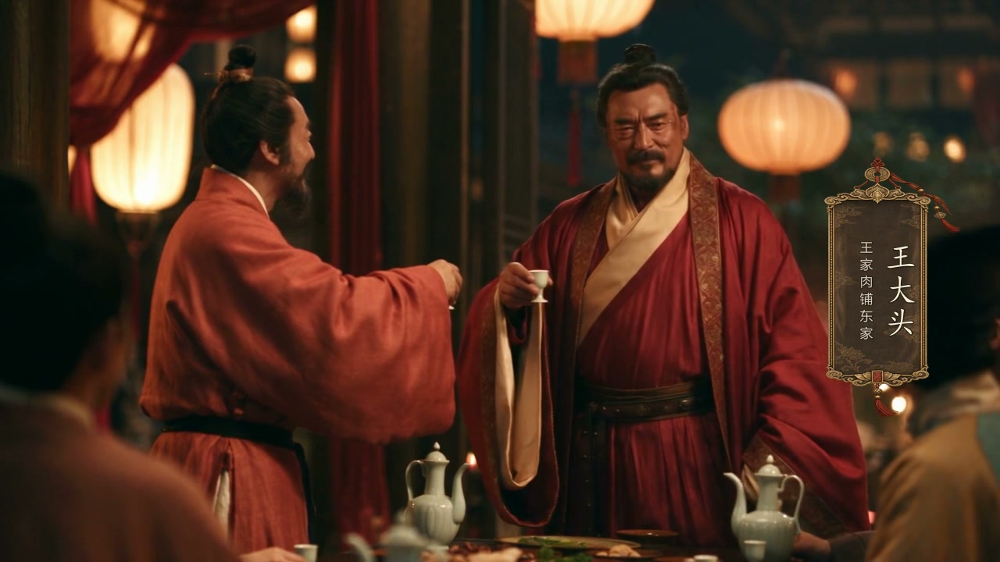

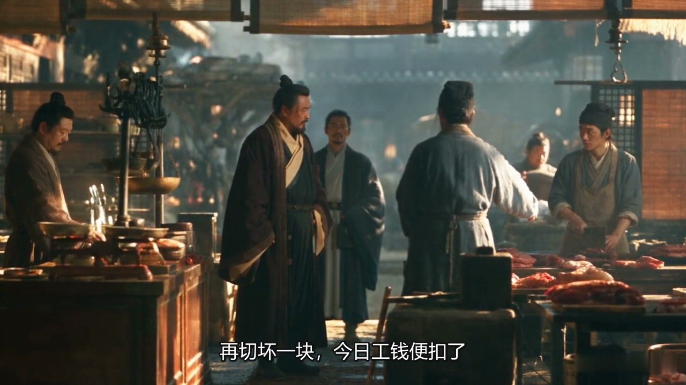

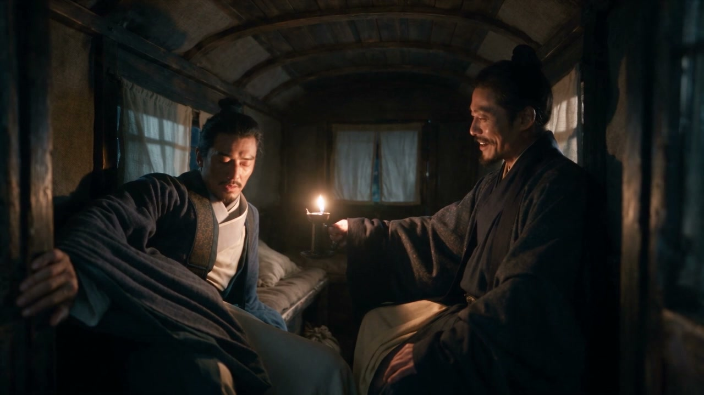

这次做出来的版本有18场、48段视频，合并后约12分11秒。当前采用的48段素材，实际任务记录均为 Seedance 2.5，影片是1280×720。这里说的电影感，指这次尝试的人物质感、光色、构图与表演方向，整部故事的节奏和连贯性仍要继续审。

有个选择，我想提前说清楚。

**跟着这篇做精细古装写实短剧，视频模型至少从 Seedance 2.5 起步。**

Mini 2.0让我能用较低成本试一些简单动画。这次有多人对话、近景表演、衣料、肉案和复杂空间，我把 Seedance 2.5作为制作选择。本例采用720p；画质、镜长和调用记录都要在实际任务里确认。型号升上去以后，导演和剪辑的工作仍然得一项项做。

最初想到复刻《长安异闻录》，是因为它有很适合拆解的古装人物、场景和道具，也有一条靠人物算计推动的故事。

刘三是算命先生。张磊来找他，请他让王大头休掉小翠。刘三收钱办事，后来又想利用王大头杀人，让小翠继承家业，自己从中获利。张磊识破他的计划，最后把刘三送进了他亲手布置的破庙杀局。

读到这里，你大概已经能明白，最重要的几个镜头应该拍什么。收钱的时候，观众要看懂委托。提出扶正的时候，要埋下家产的线索。两次约人去破庙的时候，得让观众记住这是同一个地点。张磊揭面的时候，身份变化和前面的疑点才能接起来。

这些事情，光靠写一句古装电影质感，还不够。

我先把参考资料整理进项目，保留原图、人物衣装、场景、器物和公开导演稿，再整理对白与制作稿。本例沿用了参考项目的80张原始图片，后续补充的角色档案、发言人和题签单独保留。正文是根据公开资料整理的复原稿，原作者与来源也写在制作记录里。

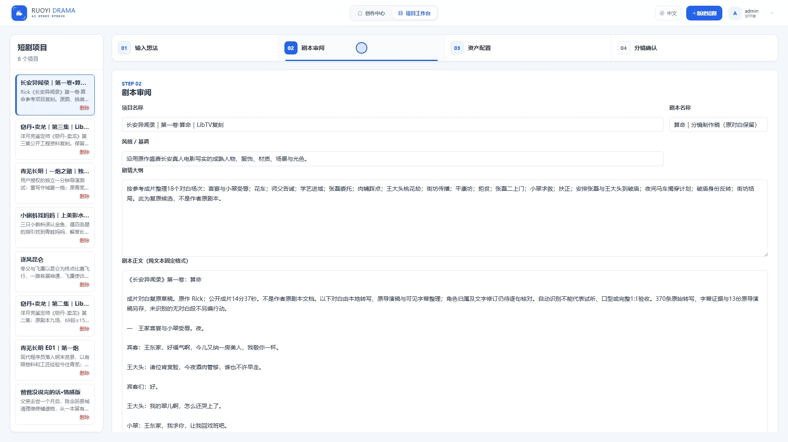

进入工作台后，顺着输入想法、剧本审阅、资产配置、分镜确认这四步走。已有故事就先核对正文，原创故事就在输入想法里写清楚谁想要什么、遇到谁阻拦、最后如何收场，再生成草稿。

我现在越来越愿意在剧本这一步多停一会儿。一个人物为什么突然答应，另一个人物为什么突然知道真相，如果正文里没有交代，后面即使脸和衣服都很好看，观众还是会跟丢。

在这次项目里，刘三让小翠成为正妻，是为了安排家产继承。他分别给张磊和王大头讲了两套破庙的说辞。这些信息要留在故事里，也要落实到镜头里。只把对白完整塞进视频，并不能保证观众已经消化了它。

剧本确认后，再看资产。

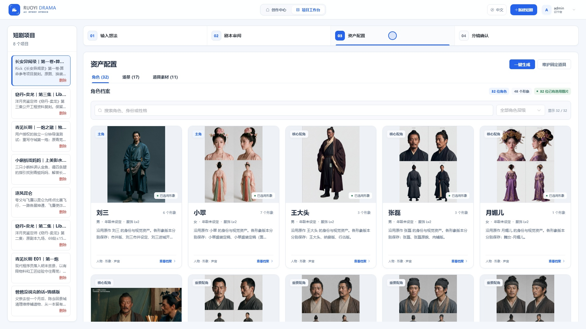

人物先要能认出来。王大头的体态、胡须和衣袍，刘三的蓝衣，小翠的戏班身份和进入王家后的衣装，都要有稳定的参考。张磊还有一个特殊要求，马贩的伪装和揭面后的年轻原貌属于同一个人，需要分别保留，按剧情阶段使用。

如果每镜都重新临时描述一个张磊，最后揭面时，观众很容易把他认成突然出现的新人物。把两种面貌放进角色档案，再明确哪镜采用哪一种，会更方便检查。

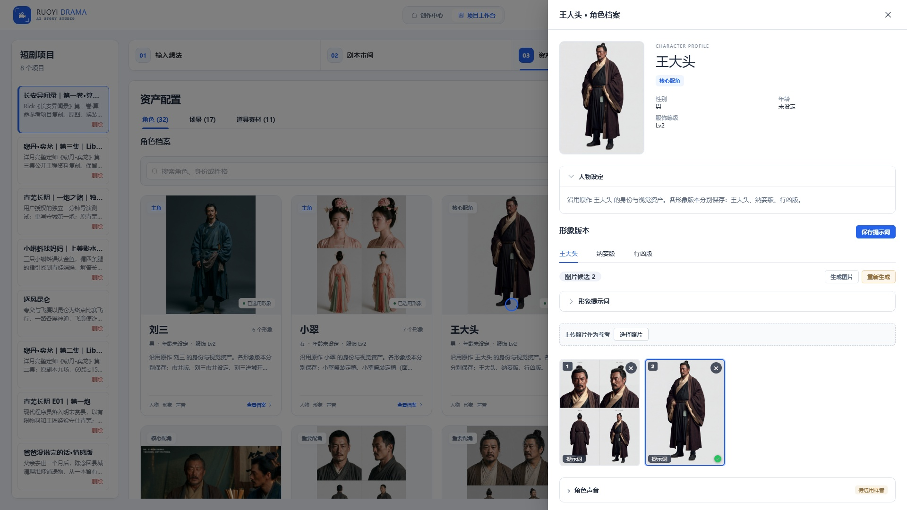

脸之外，衣服也有叙事作用。宴席上的红袍、肉铺里的日常衣装、夜间的蓝衣，得跟人物此刻的处境对应。可以保留多个版本，但一段连续场景里，不应随意换衣或换头饰。

场景同样需要固定下来。

肉铺的两侧案台、秤具、门口和中央通道，决定人物从哪里进、站在哪里、朝谁说话。算命铺里的桌子、座位和门，决定谁是来客、谁掌握谈话。破庙的香案、残像和烛火，决定对峙时两人的左右位置。

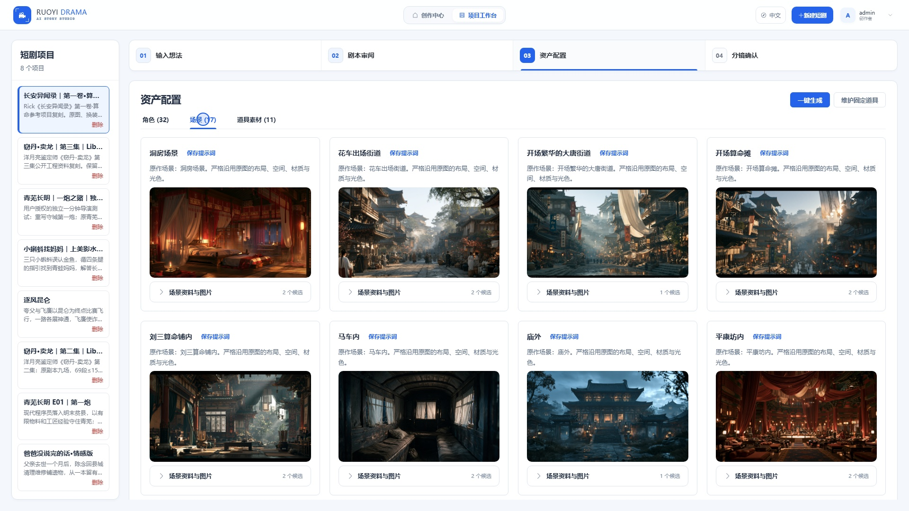

道具也要单独看。银子是委托和贪念的线索，文书关系到小翠的名分，屠刀关系到破庙杀局，易容用品关系到张磊的身份。它们出现的时候，都应该有明确的用途、位置和持握状态。

资产整理好以后，才把故事拆成视频段落。

这里的48段，是这次制作使用的生成段落数量。真正的摄影重点，要看每一段想让观众得到什么信息。有人说话时，另一人是在听、回避、观察，还是已经作出决定？这些反应应当留在导演稿里。

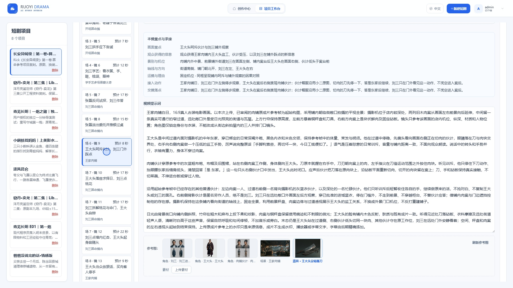

生成前，我会在具体镜头检查视频模型，确认选的是 Seedance 2.5。历史项目的预设可能和已有视频的真实型号不同，所以还要看原任务回执。这次最终48段采用的是2.5素材，任务回执已经核对了实际型号。

本例的画质是720p，视频秒数填写-1，让模型自动决定输出长度。预计时长则用于制作时估算对白、动作和反应。自动时长可以省去逐镜填秒数，但内容多的时候，仍得先判断一段里能不能自然说完。

首帧是可选参考。多数镜头可以从已确认的角色、场景和起始构图展开；需要准确复现某个空间或机位时，再上传经过审阅的画面。本例后来修正第9镜，就用了参考成片的铺内画面作为起始参考。

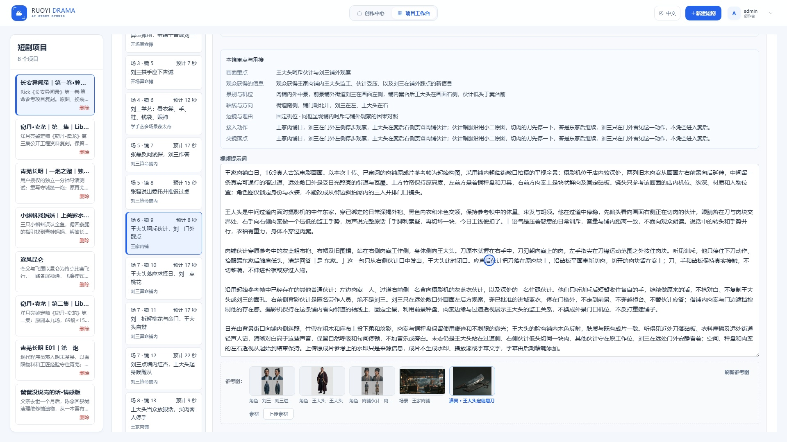

导演稿要把表演写成一个能执行的过程。

比如肉铺这一段，先交代摄影机在铺内朝街拍，两侧肉案形成纵深，王大头在中央偏前，右侧伙计在案后。王大头看见切肉动作，呵斥伙计。伙计停下刀，转向东家应声，等话说完，再回到案上。

这样写，动作和反应有了先后，人物视线有了去处，刀与手也有了应该保持的距离。机位、光色、声源和最后停住的状态继续补进去，模型才有一套具体的表演和摄影安排。

我也会检查本镜到底是谁在说话。画面里出现的人，不一定都开口。师父的教学可能是画外声，肉铺伙计的应声则应该由伙计完成。需要固定声音时，可以先在角色档案绑定经过试听的样音；本次影片主要沿用了视频生成的同步音频。

这些文字准备得再细，还是要看片。

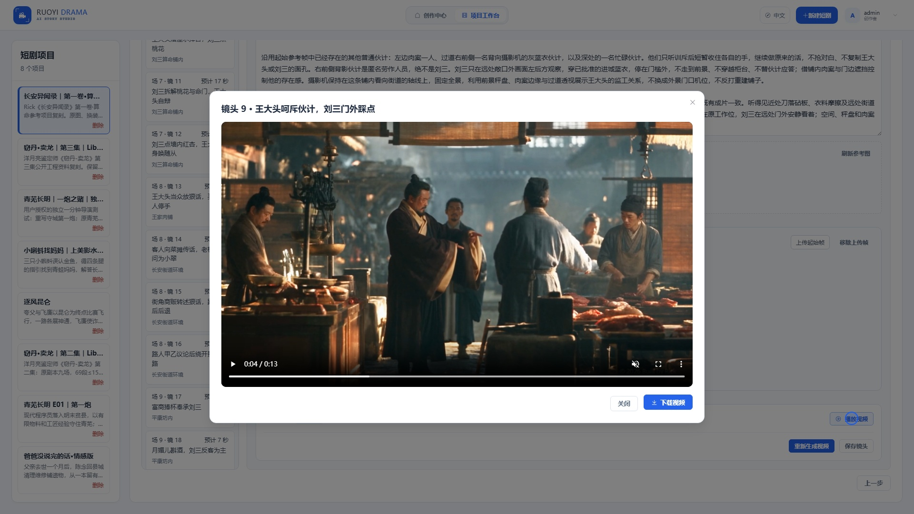

这次最直观的例子，是成片两分钟左右的肉铺镜头。第一版把刘三放在门口，人物和肉案挤在另一侧。用户指出机位不对，并给了原作铺内朝街的参考。

我回到第9镜，保存旧片，重新写清楚机位、中央通道、案台和人物站位，再用 Seedance 2.5、720p重做这一镜。其他47段保留，单独替换需要修正的素材。

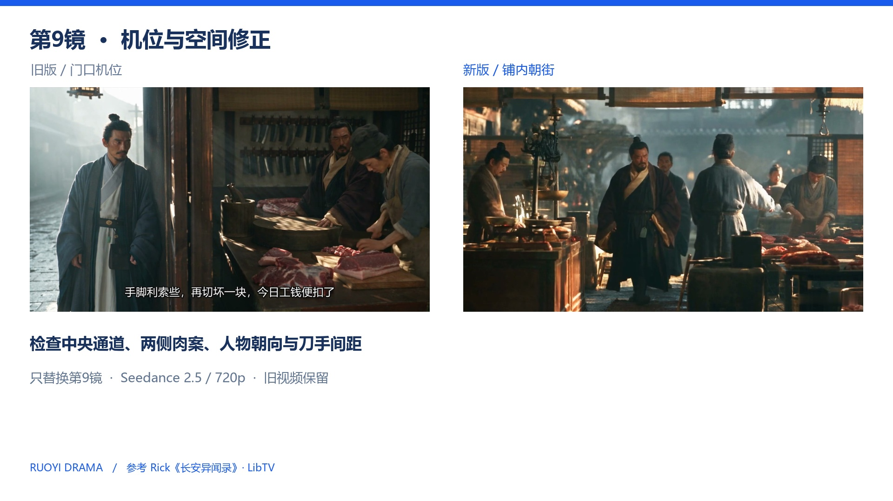

这个变化很具体。观众可以先看到肉铺的完整空间，再看东家训斥伙计。对于需要方向和距离的场景，参考画面的用途，是把这一场怎么站、怎么拍交代清楚。

镜头生成结束后，就进入合成和后期。

工作台的成片合成可以选择已完成镜头，安排转场和画幅。本例的48段合并、最终字幕、人物题签和单镜替换，由本地FFmpeg后期完成，成片文件与工作台原始视频分别保存。教程也会把工作台操作和这次实际采用的后期流程分开展示。

加字幕时，要按实际对白时间重新对齐。第9镜重做后，比旧片短了1.024秒，后面的字幕和人物题签一起前移。这次最后保留了206条字幕，对白字号是46，方便在720p画面里阅读。

人物介绍卡也做了两版。初版金边墨底比较硬，后来按反馈重新生图，改成暖褐绢纹，加入莲瓣、卷草、铜钱、朱红绳结和小印章。名字和身份另外准确排版，六位人物出场时各显示约3.8秒。

后期还有一个容易忽略的地方。只改字幕和题签时，原有对白音轨可以保留；替换镜头后，则要重新核对时间线。导出尺寸、完整解码和音轨检查能证明文件正常，真正的表演、声音和节奏，还得靠播放来听、来看。

而且，我收到的最新反馈恰好是，剧情太快，没看懂。

这个反馈得留在制作记录里。

因为它把这次尝试最真实的一面说出来了。画面可以逐步接近想要的电影感，人物、衣料和古代空间也能慢慢统一；观众能否理解刘三的贪念、张磊的试探、两套破庙计划，又需要单独检查。下一次审稿时，要留住关键决定和反应，让信息有时间落到观众心里。

我的做法会更倾向于先做一场有完整来回的对话，检查角色、光色、动作和对白，再继续整集。这样也能更早看见问题，避免等48段都完成后，才发现某个重要关系始终没有讲明白。

所以，如果你也想用这个项目做精细古装短剧，可以先准备一个人物关系清楚的短场景，建立固定角色、空间和关键道具，选择 Seedance 2.5，把每个动作和反应写进导演稿，生成后逐镜播放，保留旧版再作局部修正。

RuoYi Drama已经能把这些制作环节放进同一个工作台。接下来，每一条片子好不好看、好不好懂，就要靠这些具体选择慢慢磨出来了。

参考作品为 [Rick《长安异闻录》第一卷·算命，LibTV](https://www.liblib.tv/detail/6bc8b8d159d04627a881c39bfa58a5fb)。本文介绍本项目的复刻制作过程，截图和片段均来自当前制作资料。Seedance 2.5型号与自动时长等参数可核对 [Atlas官方模型文档](https://www.atlascloud.ai/docs/more-models/bytedance/seedance-2.5-reference-to-video/generateVideo)。
