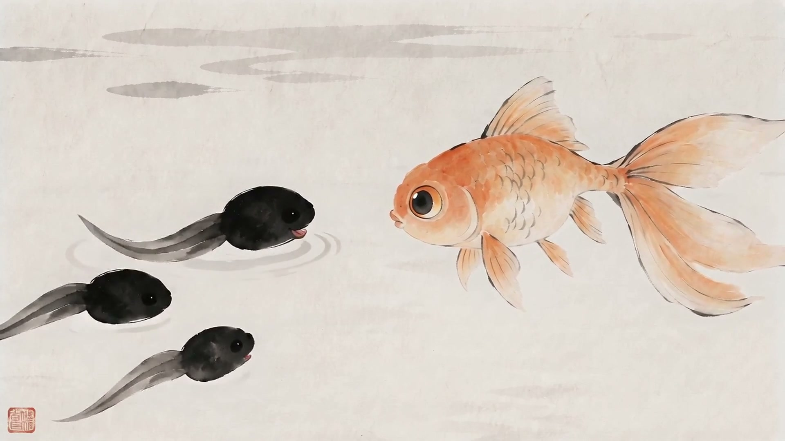

# 把荷塘留白，把故事讲清：用 RuoYi Drama 做一段水墨动画

三只小蝌蚪在纸白里游过，荷叶只占画面一角。一尾浅赭色的金鱼迎面而来，孩子们认错了妈妈。

这次给 RuoYi Drama 做样片，我选了《小蝌蚪找妈妈》。故事很熟悉，正好把注意力放在画面上，看看墨色、留白和简单的动物造型，能不能一起撑起一段有对白的动画。

最后保留的是一版 57 秒的样片。四段内容依次是寻找与误认、认错与指引、找到却犹豫、解答与团聚。原来的 15 秒版本还在项目里，这次继续沿用已经选好的蝌蚪、妈妈和荷塘，只补了金鱼。

## 先把水墨这件事说具体

写一句「上美影风格」，还不够。

手绘平涂、水墨淡彩、剪纸和敦煌重彩，对轮廓、色块和肌理的要求不同。《小蝌蚪找妈妈》这次采用水墨淡彩，允许浓淡墨色和很轻的浅彩过渡。把平涂分支里的「绝对不要渐变」直接贴过来，会把想保留的墨色变化也一起压掉。

我把本剧色盘固定为墨黑、淡墨、荷叶绿、宣纸白、浅赭。蝌蚪用墨黑，荷叶和妈妈主要用绿，金鱼用浅赭。每个画面按需要使用这些颜色，不要求五种颜色同时出现。

留白还要给行动让路。蝌蚪要从左边游到右边，妈妈要从荷叶跳进水里，就得提前给它们留出能看清的水域。荷叶画得太满，孩子们游进去就被挡住，数量和动作都难判断。

这也是我喜欢这一版画面的一点。水不必画成透明的三维物体，几笔淡墨水纹，加上游动方向，就能交代它们在哪里。

## 把审美和导演规则分别保存

项目里接入了两项技能。审美技能负责造型、色盘和媒介，导演技能负责动作、回应、摄影、声音与交镜。

这次使用的上游项目是 liangdabiao 的 smy-seedance-storyboard。我们保留了上游原文和固定提交，又按 RuoYi Drama 的字段与制作流程做了适配。实际生成使用的是后台保存的技能内容，复制一个目录到源码里，还需要完成后台登记与项目绑定。

拆开维护有个直接好处。后来要加对白、改故事节奏，可以继续使用原来的形象和色盘，不必从头换一套画面。

## 对白让寻找有了下一步

最早只做了一个 15 秒片段。看过画面后，我们又把它改成接近一分钟的版本，并加入对话。

「大眼睛！是妈妈！」

「我不是呀。你们的妈妈，有四条腿。」

孩子先用大眼睛判断，金鱼纠正它们，再给出新的线索。见到青蛙后，孩子又发现自己和妈妈长得不一样。妈妈的回答接住这个疑问，故事才走到团聚。

这里没有加旁白、配乐和字幕。说话的人、听者的反应和轻水声承担叙事。要是角色只负责把设定念出来，再漂亮的画面也会显得生硬。

## 母版先看形态，镜头再安排动作

角色母版里，蝌蚪就是圆头和一条细尾。青蛙妈妈有完整四肢、宽嘴和鼓眼。金鱼保留鳍和纱尾。荷塘母版则负责荷叶、水纹和可游动的空白空间。

母版不用一次塞下误认、提问、转身和团聚。把身份画清楚，镜头里再决定谁先游、谁停下来、谁说话、谁安静听。

首帧也是可选的。这次的流程能从已选角色和场景参考展开，不要求给每段视频额外做一张首帧。确实需要锁定起始构图时，再选用已审阅的画面。

## 三只蝌蚪，是这次最具体的难点

提示词写了三只，画面还是可能少一只、多一只，或者让幼体长出腿。

这次出现过这样的候选。后来把三只孩子固定在上、中、下三个可跟踪的位置，彼此留出间隔，头和尾都放在空白水域。金鱼说「四条腿」时，让镜头主要看金鱼，不同时要求模型重画孩子的身体变化。

这套写法帮助我们整理出了当前样片，但约束写进提示词后，仍得看真实画面。退回的候选和原任务都保留着，不能只拿任务完成状态当验收。

## 四段合成，保留两版

新版最终使用 15、12、15、15 秒。第二段按实际内容剪成 12 秒，合计 57 秒。

旧版和新版都存在，分镜列表按剧本版本查看。合成时只选新版四个镜头，避免把原来的 15 秒片段也拼进去。

这版还留着一些生成细节，比如画面里的小红印章，提示词要求去掉也没有完全奏效。最终导出是 1080p、30 帧，原视频是 720p、24 帧，合成规格不代表补出了新的细节。对白内容和时间区间做过识别核对，声音是否自然、口型是否准确，还需要实际播放来判断。

我想保留下来的，是这套能继续改的制作过程。故事输入、剧本、角色形象、声音、导演稿和视频都在同一个项目里。下一次换一个故事，可以先确定子风格和色盘，从几秒钟的样片开始检查，再往后做。

先让纸白、墨色和动作对上，再把故事讲长。

项目代码见 [RuoYi Drama](https://github.com/ageerle/ruoyi-drama)，配套后台见 [RuoYi AI](https://github.com/ageerle/ruoyi-ai)。上游技能见 [smy-seedance-storyboard](https://github.com/liangdabiao/smy-seedance-storyboard)。完整操作步骤见随附教程。
