# 上美影水墨淡彩短剧制作教程

案例为已完成的《小蝌蚪找妈妈》57 秒对白样片。下面展示真实项目的入口与结果，截图期间没有重新生成媒体。教程可以用于新故事，不要求照搬本例的镜头数量。

## 1．准备后台与模型

先运行 ruoyi-ai，配置数据库、缓存、存储以及 FFmpeg、ffprobe，再运行前端。当前开发默认代理到后端 6039；前端端口以启动输出为准。

```bash
npm install
npm run dev
```

后台配置可用的文字、图片、视频及需要使用的声音模型。使用 Atlas 时，在右上角头像菜单打开「Key 配置」，填写密钥，点击「保存并应用」。账号需要模型编辑权限。截图中的密钥框为空。

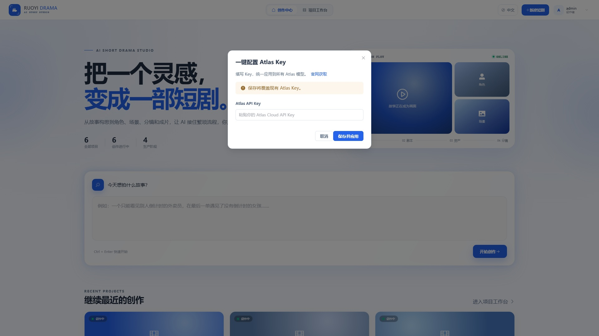

这次视频采用项目已配置的 Seedance 模型。是否支持参考图、参考声音、时长和画幅，需按所选具体型号核对，不能把一个型号的限制套给其他型号。查看已有内容不需要重新提交任务。

## 2．登记两项上美影技能

项目已保存上游原文及固定提交。适配源分别位于 `skills/smy-animation-aesthetics/` 与 `skills/smy-seedance-storyboard/`。

管理员在后台「智能体管理 → 技能管理」登记或维护制作技能，按 manifest 保存正文与参考文件。市场可以阅读内容，维护需进入后台。新安装不会仅因前端目录存在就自动注册这两项技能。

审美标识使用 `smy-animation-aesthetics`，类别为 aesthetic；导演标识使用 `smy-seedance-storyboard`，类别为 director。适配包的 artStyle 留空，让正文定义二维水墨方向。通过现有接口保存后，回读正文、类别、启用状态和内容版本，再给目标项目保存这两项绑定。完整接口约定见 `skills/smy-seedance-storyboard/README.md`。

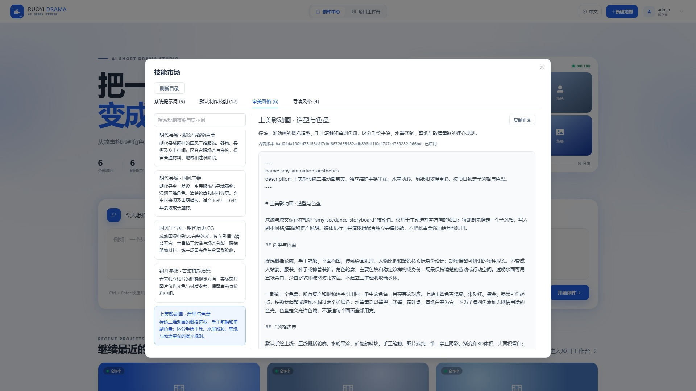

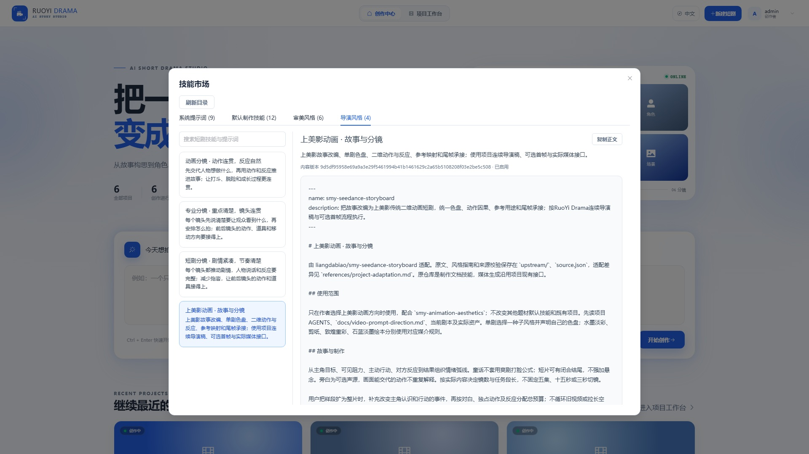

后台运行目录 `data/short-drama-skills/` 也需要备份，避免迁移后丢失已维护内容。

## 3．写清故事和唯一子风格

在创作中心填写想法，生成初版剧本；已有项目在第一步查看或单独「保存想法」。原始输入与后续剧本分别保存。本例第一步仍保留最初的 15 秒需求，后来的一分钟方案在新版剧本中。

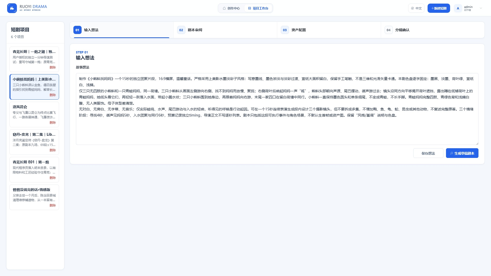

新故事可以从下面这段要求开始。它是本教程的示例输入，不是已经提交的新任务。

```text
制作《小蝌蚪找妈妈》接近一分钟的对白样片。采用上美影水墨淡彩二维动画，写意墨线、浓淡墨色、浅彩过渡、宣纸肌理与大面积留白。唯一色盘为墨黑、淡墨、荷叶绿、宣纸白、浅赭。
三只小蝌蚪先把金鱼认成妈妈，得到四条腿的线索；找到青蛙后，因外形不同而犹豫，妈妈回答成长的问题，带孩子们一起游走。孩子保持圆头细尾，不长腿。对白推动误认、纠正、疑问和回应。保留轻水声，不加旁白、配乐和字幕。先生成可审阅剧本，资产和视频逐阶段确认。
```

## 4．审阅剧本，确认对白如何推进

第二步编辑「风格 / 基调」、大纲和正文。需要重写时点「打磨剧本」，说明具体修改意见。确认后点「保存并分析资产」。

本例从「大眼睛！是妈妈！」推进到金鱼的纠正，再到「我们怎么没有腿？」与妈妈的回答。对白声源在后续导演稿里展开，剧本阶段保留人物原话与行动即可。

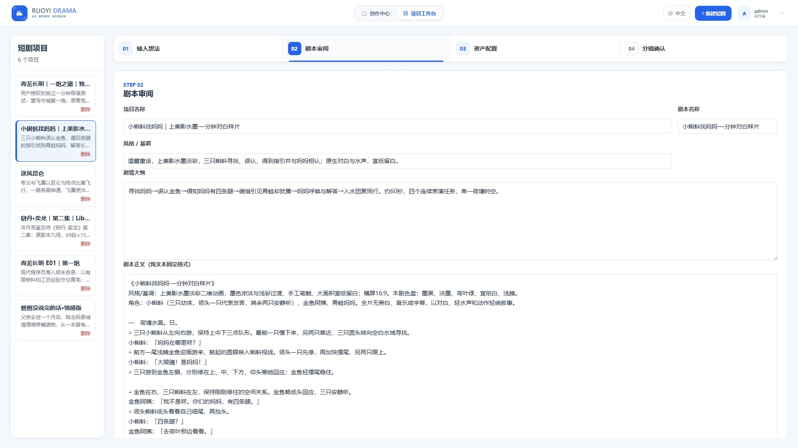

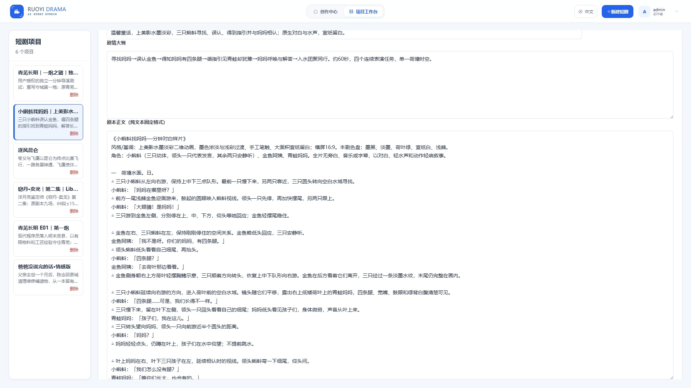

## 5．资产分析后，审阅母版

第三步整理角色、场景和道具。本例需要三只蝌蚪、金鱼阿姨、青蛙妈妈，以及荷塘。先看分析结果是否包含实际出场角色，再决定生成哪些缺图素材。

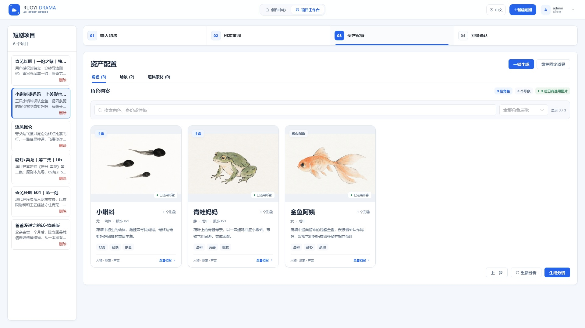

角色母版描述完整形态，不混入多个剧情动作。场景母版描述荷叶位置和空白水域，不把蝌蚪提前画进场景图。已有合格形象继续复用，不为改对白重新做一套。

可以把水墨审美要求写成下面这段，后面再接具体角色或场景。

```text
上美影水墨淡彩二维动画，写意墨线、墨色浓淡与轻微浅彩过渡、宣纸肌理、平面构图和大面积留白。本剧色盘：墨黑、淡墨、荷叶绿、宣纸白、浅赭。水域用纸白与简笔水纹表达。必须纯二维水墨淡彩，允许墨色和浅彩自身的浓淡变化；不要三维阴影、3D体积感、塑料玩具或写实摄影。
```

审图时看轮廓、数量、动物形态、笔触和色盘。水墨有墨色变化，不能套手绘平涂的「绝对无渐变」。

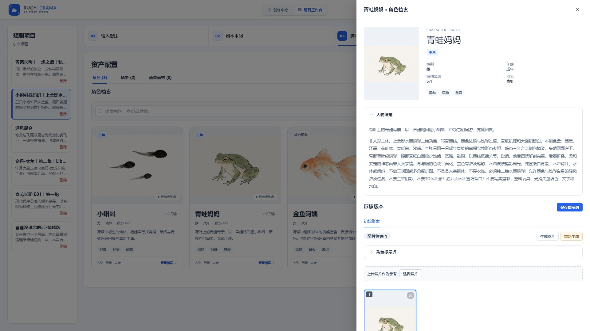

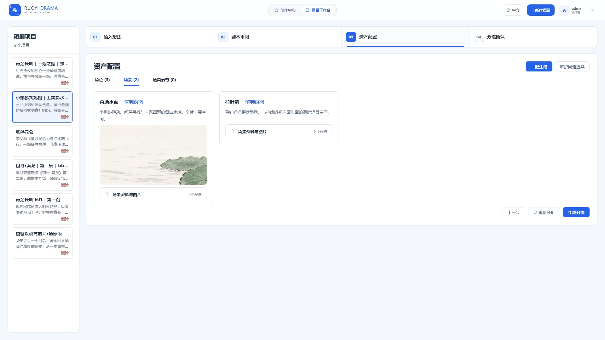

## 6．给实际说话的角色绑定声音

在角色档案展开「角色声音」，填写声音设定和样音正文，生成或上传样音，试听后选用。声音属于角色身份，同一角色换衣装不必换声音。

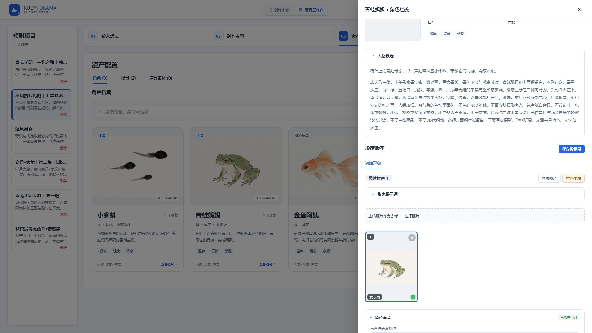

本例三只蝌蚪由领头一只代表发言，另外两只安静听。分镜中保存实际发言人，画外对白也计入。金鱼回答时孩子不抢说，孩子画外追问时金鱼不做说话口型。绑定样音之后，仍需听成片是否保持角色声音。

## 7．规划分镜，再写连续导演描述

确认资产后点「生成分镜」。尚无分镜时，可在资产页选择实际启用的「分镜方式」。已有分镜则直接进入第四步编辑；绑定仍需在后台与项目回读中核对。

本例把摄影候选审阅后整理成四段连续表演。一个生成任务里可以有景别变化，不必把每个反应都拆成新任务。

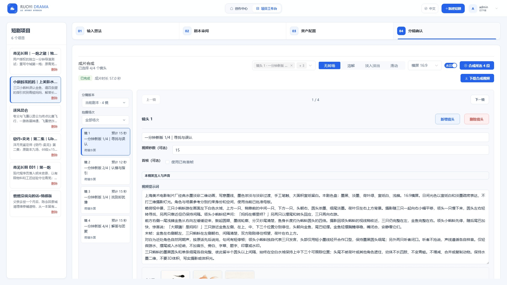

视频提示词写明起始空间、动作与回应顺序、原对白声源、摄影、光色、声音和结束状态。timing 独立记录制作估算，正文不排逐秒清单。

例如金鱼这一段，开场金鱼在右、蝌蚪在左。镜头收近到金鱼回答；孩子在左侧画外问「四条腿？」时，金鱼闭口听。金鱼示意荷叶方向，再切回同轴中景，让三只孩子一起向右游。末帧的方向和位置交给下一段。


三只孩子分别在上、中、下三个位置，头尾完整分离，彼此留出空隙。数量约束要放进动作和构图中，再用实帧检查，单写「不要增减」不能保证结果。

## 8．核对参考图、首帧与视频秒数

本镜参考图用于锁定角色身份、场景和道具；超过所选型号的参考数量时，按真正出镜的内容安排。

首帧可选。已有合格首帧且想锁定起始构图时，勾选「使用已有首帧」；不使用时，从已选资产和起始构图展开，不默认额外批量生成首帧。

「视频秒数」留空使用模型默认，明确填写时才提交对应时长；分镜估时不自动变成视频参数。具体可用值以所选型号为准。

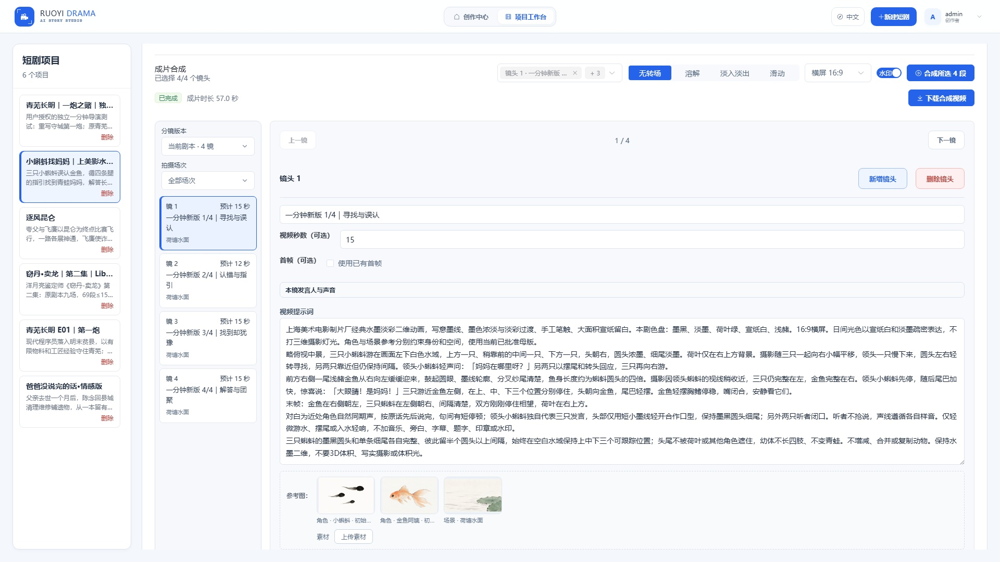

## 9．生成后检查真实画面与声音

提交视频前保存导演稿和发言人。任务受理后保存原任务号；网络中断或结果不明时，先查询原请求，不直接重提。

播放视频检查动物数量、形态、运动方向、遮挡、对白顺序与听者口型。本例退回过缺少蝌蚪、幼体长腿的候选。最终片段保留了清楚的三只幼体；部分画面仍有模型生成的小红印章。

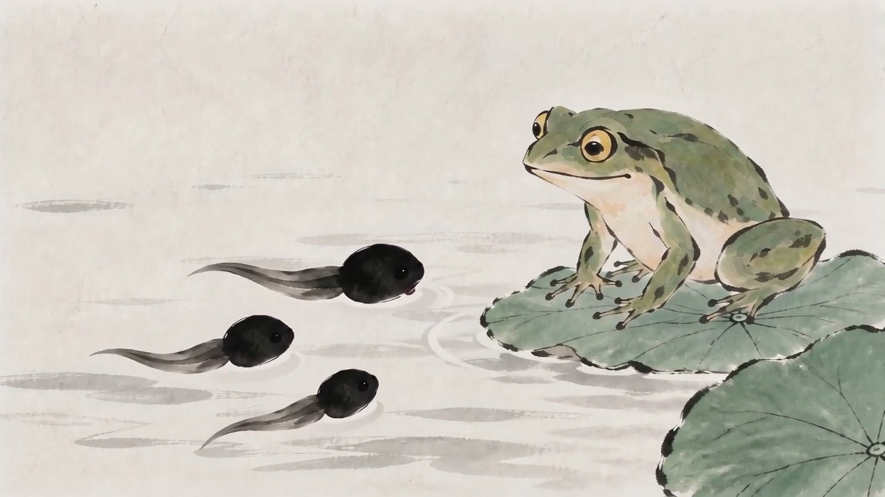

语音识别可辅助检查漏句和时间区间，但不能代替试听或口型检查。

## 10．选择新版合成并下载

在第四步选择当前剧本版本。原 15 秒版保留在历史版本，合成只选新版四段，避免混入旧镜头。

最终使用 15、12、15、15 秒，合计 57 秒。第二段的 12 秒来自实际剪辑，不能为了凑一分钟强行拉长静默。合成完成后通过「下载合成视频」保存结果。

本例合成导出 1080p、30 帧，来源是 720p、24 帧的生成原片；导出规格不等于原生画面细节。制作完成后保留原片、退回候选、剪辑时间线和合成结果，便于继续修改。

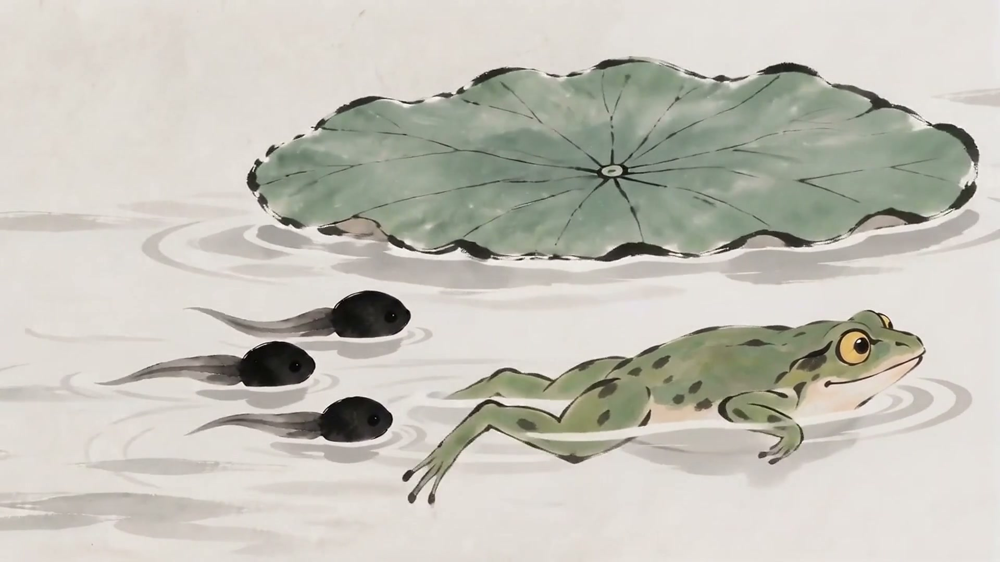

## 相关资料

- [推文正文](article.md)
- [项目上美影技能](../../../skills/smy-seedance-storyboard/README.md)
- [视频导演规范](../../video-prompt-direction.md)
- [原始创作输入保存](../../creative-idea-persistence.md)
- [角色声音](../../character-voices.md)
- [上游开源项目](https://github.com/liangdabiao/smy-seedance-storyboard)
